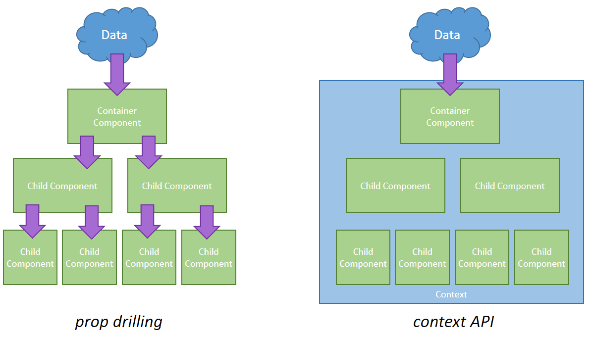

# Context API


Context API đơn giản là một phương thức quản lý state. Đầu tiên ta sẽ tìm hiểu về cách quản lý state thông thường của React :


Ở đây khi ta muốn truyền props từ parent1 xuống child2 ta sẽ phải truyền theo thứ tự : Parent1 -&gt; Child -&gt; Child2, dù có thể Child hoàn toàn không cần dùng đến dữ liệu mà Parent truyền xuống, nhưng nó vẫn phải thực hiện đúng thứ tự ấy. Điều này gây ra những nhập nhằng và thừa code không cần thiết. Để giải quyết vấn đề ấy, Context API ra đời : 



Ý tưởng của React Context API là nó sẽ tập trung dữ liệu vào một nơi. Sau đó, nó cung cấp cơ chế cho phép mỗi component có thể lấy state cũng như cập nhật state trực tiếp tại đó mà không cần qua các component trung gian.

So với cách quản lý state thông thường, cách này có ưu, nhược điểm là:

* **Ưu điểm**: hạn chế lặp lại code, hạn chế việc truyền props không cần thiết và quản lý state dễ dàng hơn.
* **Nhược điểm**: khó tái sử dụng component vì state tập trung tại một chỗ, tương tự như việc sử dụng biến toàn cục vậy.

Bây giờ ta sẽ tìm hiểu cách hoạt động của Context API.

#### React.createContext\(\)

```javascript
const MyContext = React.createContext(defaultValue);
```

Đây là API đầu tiên **bắt buộc** phải sử dụng. API này sẽ tạo mới một [object](https://completejavascript.com/javascript-object-last-but-not-least/) đóng vai trò là Context. Và khi một component đăng ký sử dụng Context này thì nó sẽ đọc giá trị context từ **Provider** gần nhất.

Ngược lại, khi bên ngoài nó không có một **Provider** nào thì giá trị của context sẽ ứng với giá trị **defaultValue** bên trên.

#### Context.Provider <a id="contextprovider"></a>

```javascript
<MyContext.Provider value={/* some value */}>
```

Với mỗi một đối tượng Context sẽ tồn tại một đối tượng Provider. Đối tượng này có một property là **value**. Giá trị của **value** được hiểu là giá trị của Context.

Mỗi khi giá trị của **value** này thay đổi thì các thành phần bên trong Provider này sẽ bị render lại. Vì vậy, giá trị của **value** sẽ tương ứng là state của chương trình.

#### Class.contextType <a id="classcontexttype"></a>

```javascript
class MyClass extends React.Component {
  componentDidMount() {
    let value = this.context;
    /* perform a side-effect at mount using the value of MyContext */
  }
  componentDidUpdate() {
    let value = this.context;
    /* ... */
  }
  componentWillUnmount() {
    let value = this.context;
    /* ... */
  }
  render() {
    let value = this.context;
    /* render something based on the value of MyContext */
  }
}

MyClass.contextType = MyContext;
```

Nếu như hai API trên là để khởi tạo Context và truyền giá trị cho Context thì API này dùng để sử dụng giá trị của Context.

Ở đây, thuộc tính **contextType** được gán giá trị là **MyContext** - thành phần được khởi tạo bởi _React.createContext\(\)_ bên trên.

Sau đó, mình có thể truy cập đến giá trị của Context thông qua **this.context** ở bất kỳ phương thức nào thuộc React Lifecycle và cả phương thức **render\(\)** nữa.

#### Context.Consumer <a id="contextconsumer"></a>

```javascript
<MyContext.Consumer>
  {value => /* render something based on the context value */}
</MyContext.Consumer>
```

Tương tự **Class.contextType**, API này giúp sử dụng giá trị của Context. Tuy nhiên hơi khác một chút là API này chỉ sử dụng ở phần JSX.

Trong đó, **value** chính là giá trị của Context. Và dĩ nhiên, khi bên ngoài component hiện tại không có Provider nào thì **value** chính là **defaultValue**.

Trên đây là những thông tin cơ bản về các API của React Context. Tiếp theo, mình sẽ làm một ví dụ cụ thể để demo cho các API này.

### Demo

Ở ví dụ này, mình có 3 Component là: Red, Blue và Green - theo đúng thứ tự component Red chứa component Blue và component Blue chứa component Green.

Component Red và Green hiển thị giá trị của state - number. Component Blue chứa 2 button để thay đổi giá trị state \(tăng hoặc giảm 1 đơn vị\).

Với mỗi component, mình sẽ sử dụng một cách khác nhau để đọc giá trị của context. Và sau đây là cách mình triển khai code.



```javascript
import React from 'react';
import Red from './Red';

export const AppContext = React.createContext();

class AppProvider extends React.Component {
  state = {
    number: 10,
    inc: () => {
      this.setState({ number: this.state.number + 1 });
    },
    dec: () => {
      this.setState({ number: this.state.number - 1 });
    }
  };

  render() {
    return (
      <AppContext.Provider value={this.state}>
        {this.props.children}
      </AppContext.Provider>
    );
  }
}

const App = () => (
  <AppProvider>
    <Red />
  </AppProvider>
);

const rootElement = document.getElementById("root");
ReactDOM.render(<App />, rootElement);
```

**AppProvider** chính là một Higher-Order Component dùng để đóng gọi lại _AppContext.Provider_. Mà khi mình luôn sử dụng **Provider**, thì có nghĩa là _AppProvider_ chính là Component lớn nhất chứa tất cả các Component còn lại. Do đó, mình sẽ định nghĩa state của App tại đây.

Như bạn thấy, **state** bao gồm:

* Biến **number**: dùng để hiển thị ở component Red và Green.
* Phương thức **inc\(\)**: dùng để tăng giá trị biến state _number_ lên 1 đơn vị.
* Phương thức **dec\(\)**: dùng để giảm giá trị biến state _number_ đi 1 đơn vị.

Cuối cùng, bên trong hàm _render\(\),_ mình truyền giá trị _this.state_ vào _value_ của _AppContext.Provider_.



```javascript
import React from 'react';
import AppContext from './App';
import Blue from './Blue';

class Red extends React.Component {
  render() {
    return (
      <div className="red">
        {this.context.number}
        <Blue />
      </div>
    );
  }
}

Red.contextType = AppContext;

export default Red;
```

Ở đây, mình sử dụng **Class.contextType** nên cần khai báo _Red_ dạng class component. Và cách sử dụng thì khá đơn giản như mình đã đề cập ở trên.

Mình xin nhấn mạnh lại, **this.context** tương ứng với giá trị của context tại Provider gần nhất. Đó chính là giá trị **this.state** mà mình truyền vào _AppContext.Provider_ bên trên



```javascript
import React from 'react';
import AppContext from './App';
import Green from './Green';

export default const Blue = () => (
  <div className="blue">
    <AppContext.Consumer>
      {context => (
        <>
          <button onClick={context.inc}>INC</button>
          <button onClick={context.dec}>DEC</button>
        </>
      )}
    </AppContext.Consumer>
    <Green />
  </div>
);
```

Ở component Blue, mình chỉ cần khai báo dạng Functional Component vì mình không sử dụng state cũng như các phương thức lifecycle tại đây.

Bạn chú ý bên trong _AppContext.Consumer_ là function dùng để render. Với context chính là giá trị của context tại Provider gần nhất. Đó cũng chính là giá trị **this.state** mà mình truyền vào _AppContext.Provider_ bên trên.

Bên trong hàm render trên, mình sử dụng thẻ rỗng &lt;&gt;. Tuy nhiên, bạn cũng có thể sử dụng [React.Fragment](https://reactjs.org/docs/fragments.html). Như vậy là hợp lý vì mình không muốn thêm một thẻ **div** vô nghĩa tại đây.



```javascript
import React from 'react';
import AppContext from './App';

export default class Green extends React.Component {
  render() {
    return (
      <div className="green">
        <AppContext.Consumer>
          {context => context.number}
        </AppContext.Consumer>
      </div>
    );
  }
}
```

Với mục đích demo, mình khai báo component Green dạng Class Component. Chứ thực tế là mình có thể khai báo nó dạng Functional Component.

Về cách sử dụng Context thì hoàn toàn giống bên trên rồi nhỉ?



Như vậy là mình đã tìm hiểu và làm Demo xong về React Context API. Dĩ nhiên, đây mới chỉ là một ví dụ đơn giản. Nên chưa thể khẳng định rằng mình có thể sử dụng React Context để thay thế hoàn toàn cho Redux. Tuy nhiên, tại thời điểm hiện tại mình thấy React Context API vẫn rất ổn.

