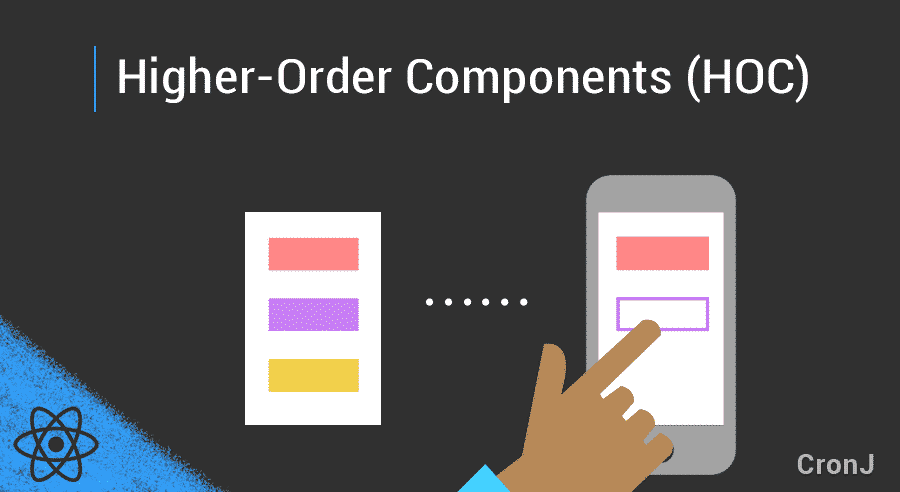
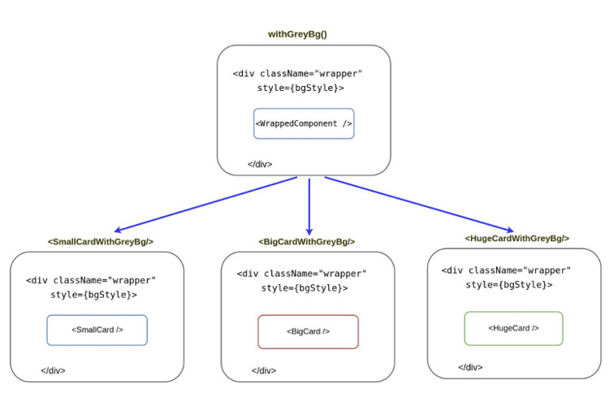

# High Order Component



High Order Component \(HOC\) tuy gọi là component nhưng thực tế nó là một function nhận vào một tham số là component và trả về bản mở rộng component đó. Có thể mô tả như sau :

```javascript
const NewComponent = (BaseComponent) => {
    // … create new component from old one and update
    return UpdatedComponent
}
```

Để hiểu rõ về HOC trước tiên ta sẽ bắt đầu với khái niệm High Order Function. Đây là một dạng function nhận tham số là một function khác : 

```javascript
const calculator = (inputFunction) => (...args) => {
    const resultValue = inputFunction(...args);
    console.log(resultValue);
    return resultValue;
}

const add = (...all) => {    
    return all.reduce((a, b) => a + b, 0);
}

calculator(add)(3,6,9,12,15,18);
// => 63
```

Ở trên hàm add nhận vào input không giới hạn và cộng chúng lại. Còn calculator nhận vào một function và trả về giá trị của function đó. Tính ưu việt của High Order Function là ta có thể sử dụng nó để thực hiện các hành động tương tự, như nếu muốn thay phép cộng thành phép nhân :

```javascript
const multiply = (...all) => {
    return all.reduce((a,b) => a*b, 1)
}

calculator(mutiply)(2,4);
// => 8
```

Như vậy High Order Function cho phép ta tái sử dụng các đoạn code có giá trị tương đương. Và điều này đã được React dùng để tạo ra High Order Component. Một ví dụ về HOC :

```javascript
const withGreyBg = WrappedComponent => class NewComponent extends Component {
    const bgStyle = {
        backgroundColor: 'grey',
    }

    render() {
        return (
            <div className='wrapper' style={bgStyle}>
                <WrappedComponent {...this.props} />
            </div>
        )
    }
}

const SmallCardWithGreyBg = withGreyBg(SmallCard);
const BigCardWithGreyBg = withGreyBg(BigCard);
const HugeCardWithGreyBg = withGreyBg(HugeCard);

class CardsDemo extends Component {
    render() {
        <SmallCardWithGreyBg {...this.props} />
        <BigCardWithGreyBg {...this.props} />
        <HugeCardWithGreyBg {...this.props />
    }
}
```

Ví dụ ở trên đây tạo một HOC để hiển thị background có màu xám. Ta có thể sử dụng chúng với tuỳ ý các card component. 



Trong thực tế là chả ai đi tạo một HOC chỉ để đổi background, vì điều này sẽ ảnh hưởng đến hiệu năng trang web. Ta sẽ cần một ví dụ thực tế hơn như là lưu state vào trong localstorage. 

```javascript
import React from 'react';
    const withStorage = WrappedComponent => {
        class HOC extends React.Component {
            state = {
                localStorageAvailable: false
            };
            componentDidMount() {
                this.checkLocalStorageExists();
            }
            checkLocalStorageExists() {
                const testKey = 'test';
                try {
                    localStorage.setItem(testKey, testKey);
                    localStorage.removeItem(testKey);
                    this.setState({ localStorageAvailable: true });
                } catch (e) {
                    this.setState({ localStorageAvailable: false });
                }
            }
            load = key => {
                if (this.state.localStorageAvailable) {
                    return localStorage.getItem(key);
                }
                return null;
                };
                save = (key, data) => {
                if (this.state.localStorageAvailable) {
                    localStorage.setItem(key, data);
                }
            };
            remove = key => {
                if (this.state.localStorageAvailable) {
                    localStorage.removeItem(key);
                }
            };
            render() {
                return (
                <WrappedComponent
                    load={this.load}
                    save={this.save}
                    remove={this.remove}
                    {...this.props}
                />
            );
        }
    }
};
```

Đầu tiên trong `withStorage` sẽ khai báo một state là `localStorageAvailable` để track xem `localStorageta` có sẵn sàng trong browser chưa. Chúng ta dùng `componentDidMount` để gọi function `checkLocalStorageExist` để kiểm tra localStorage. Chúng ta sẽ kiểm tra việc saving của item và set state thành true nếu thành công.

Chúng cũng sẽ add ba function vào HOC đó là: `load` , `save` , và `remove`. Chúng được dùng để truy cập ngay đến `localStorage` API nếu như nó đã sẵn sàng. Ba function này sẽ được pass vào wrapped component nơi chúng được dùng.

Bây giờ chúng ta sẽ tạo một component mới để wrapped `withStorage` HOC. Nó sẽ được dùng để hiện tên, bộ phim ưa thích của user. Tuy nhiên, API gọi để lấy thông tin này tốn một khoảng thời gian. Chúng ta có thể cho là những giá trị này sẽ không bao giờ thay đổi một khi đã được thiết lập.

Để chắc chắn chúng ta có một trải nghiệm người dùng tuyệt vời, chúng ta sẽ chỉ thực hiện API này khi các giá trị chưa được lưu. Sau đó mọi lúc user quay lại page này, họ sẽ có thể truy cập tới data ngay thay vì phải chờ kết qủa từ API.

```javascript
import React from 'react';
import withStorage from 'components/withStorage';

class ComponentNeedingStorage extends React.Component {
  state = {
    username: '',
    favoriteMovie: '',
  }

  componentDidMount() {
    const username = this.props.load('username');
    const favoriteMovie = this.props.load('favoriteMovie');
    
    if (!username || !favoriteMovie) {
      // This will come from the parent component
      // and would be passed when we spread props {...this.props}
      this.props.reallyLongApiCall()
        .then((user) => {
          this.props.save('username', user.username || '');
          this.props.save('favoriteMovie', user.favoriteMovie || '');
          this.setState({
            username: user.username,
            favoriteMovie: user.favoriteMovie,
          });
        }); 
    } else {
      this.setState({ username, favoriteMovie })
    }
  }

  render() {
    const { username, favoriteMovie } = this.state;
    
    if (!username || !favoriteMovie) {
      return <div>Loading...</div>; 
    }
    
    return (
      <div>
        My username is {username}, and I love to watch {favoriteMovie}.
      </div>
    )
  }
}

const WrappedComponent = withStorage(ComponentNeedingStorage);

export default WrappedComponent;
```

Bên trong `componentDidMount` của wrapped component, chúng ta sẽ cố gắng truy cập vào `username` và `favoriteMovie` từ `localStorage`. Nếu không có giá trị, chúng ta sẽ call API. Những lần sau thì chúng ta chỉ cần truy cập vào `localStorage` để lấy giá trị.  
Dù khá tiện ích nhưng có những điều mà ta vẫn phải cần nhắc khi sử dụng High Order Component như sau :

* Một HOC nên là pure function không có side-effects. Nó không nên làm thay bất cứ thứ gì và chỉ kết hợp original comonent bằng cách bao nó bằng một component khác.
* Không sử dụng HOC trong phương thức render của một component. Truy cập HOC ngoài component.
* Static method phải được copy để vẫn có thể truy cập chúng. Một cách đơn giản để làm điều này đó là dùng `hoist-non-react-statics`
* Không dùng Refs

