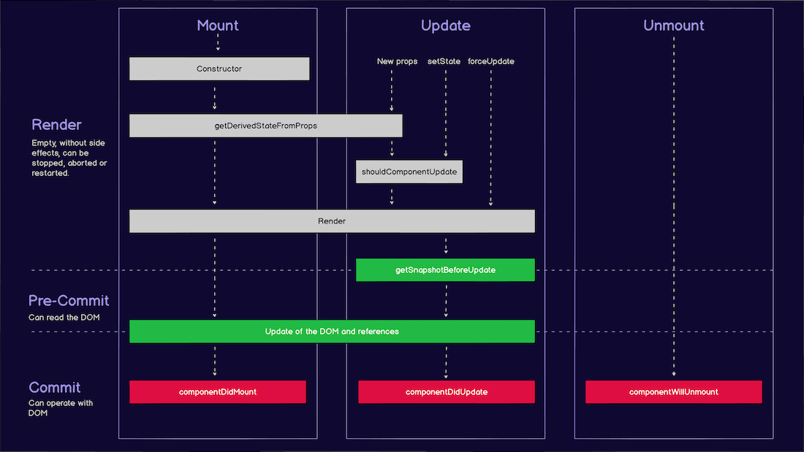
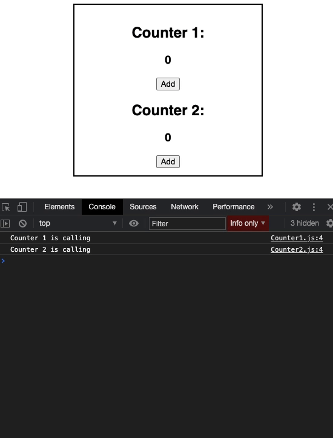
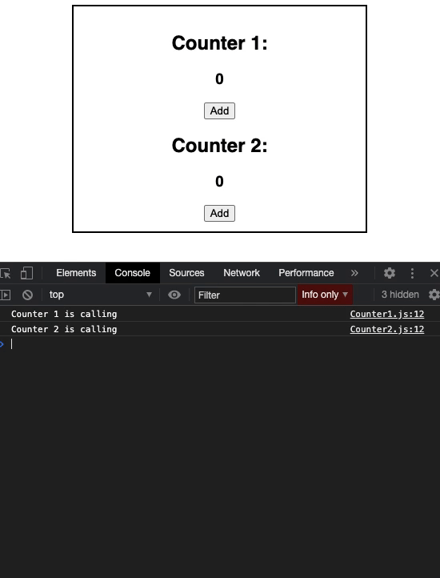

# Lifecycle



Vòng đời của một component tức là từ lúc nó được khởi tạo và xuất hiện trong DOM của trình duyệt, re-render lại và bị unmount khởi DOM. Vòng đời gồm 3 giai đoạn chính : Mouting, Updating và Unmouting.

## 1.Mouting

Mouting là quá trình thêm component vào DOM. Theo trật tự thì quá trình tạo component từ lúc khởi tạo trạng thái đến lúc đưa vào DOM như sau: 

1. _constructor\(\)_
2. _getDerivedStateFromProps\(\)_
3. _render\(\)_
4. _componentDidMount\(\)_

### constructor\(\):

Giống như ở bài trước, đây là quá trình khởi tạo state cho component. Nó thiết lập các state ban đầu. 

```javascript
constructor(props){
    super(props);
    this.state = {
        name: "Default",
        value: 0,
    }
}
```

###  **getDerivedStateFromProps\(\):**

Đúng như tên gọi. Đây là phương thức lấy trạng thái từ props nhận về của component cha. Phương thức được gọi trước khi hiển thị các phần tử trong DOM. Như ví dụ dưới đây:

```javascript
static getDerivedStateFromProps(props, state) {
    return { name: props.value};
}
```

### **render\(\):**

Như đã nói ở bài component, Class không thể trả về JSX trực tiếp mà phải thông qua phương thức render. Đây cũng là lần đầu tiên component xuất hiện trong DOM.

```javascript
class Header extends React.Component {
  render() {
    return (
      <h1>This is the content of the Header component</h1>
    );
  }
}
```

### **componentDidMount\(\):**

Là phương thức được gọi sau khi component đã xuất hiện trên DOM. Phương thức này chạy các câu lệnh điều khiển các component đã xuất hiện. Ví dụ :

```javascript
class Header extends React.Component {
    constructor(props) {
        super(props);
        this.state = {favoritecolor: "red"};
    }
    componentDidMount() {
        setTimeout(() => {
            this.setState({favoritecolor: "yellow"})
        }, 1000)
    }
    render() {
        return (<h1>My Favorite Color is {this.state.favoritecolor}</h1>);
    }
}
```

Trong ví dụ trên, ban đầu thông tin hiển thị ra sẽ là "My Favorite Color is red" sau 1s nó sẽ thành "My Favorite Color is yellow".

## 2. Updating 

Đây là giai đoạn tiếp theo khi component được cập nhật. Component được cập nhật bất cứ khi nào có sự thay đổi về state và props. Theo thứ tự nó có 5 phương thức như sau: 

* _getDerivedStateFromProps\(\)_
* _shouldComponentUpdate\(\)_
* _render\(\)_
* _getSnapshotBeforeUpdate\(\)_
* _componentDidUpdate\(\)_

### **getDerivedStateFromProps\(\):**

Cũng tại giai đoạn updating, phương thức `getDerivedStateFromProps` được gọi lần nữa. Đây là phương thức đầu tiên được gọi khi một component được cập nhật, nó vẫn có chức năng là thiết lập state dựa trên props ban đầu. Ví dụ về sử dụng như sau :

```javascript
class Header extends React.Component {
    constructor(props) {
        super(props);
        this.state = {favoritecolor: "red"};
    }
    static getDerivedStateFromProps(props, state) {
        return {favoritecolor: props.favcol };
    }
    changeColor = () => {this.setState({favoritecolor: "blue"});}
    render() {
        return (
        <div>
            <h1>My Favorite Color is {this.state.favoritecolor}</h1>
            <button type="button" onClick={this.changeColor}>
                Change color
            </button>
        </div>
        );
    }
}

ReactDOM.render(
    <Header favcol="yellow"/>,document.getElementById('root')
);
```

Với đoạn code trên dù ta có click vào button, thì dữ liệu hiển thị ở đoạn h1 vẫn là "My Favorite Color is yellow" vì nó đã nhận từ props favcol rồi.

### shouldComponentUpdate\(\):

Như đã nói ở trên, cứ mỗi khi state và props thay đổi, component sẽ được `re-render.` Song, không phải lúc nào ta cũng cần render lại trang, vì nó sẽ ảnh hưởng lớn đến perfomance trang web. Phương thức `shouldComponentUpdate()` sẽ quyết định khi nào phải re-render hay không.

Để làm rõ ví dụ này ta có 3 file là App.js, Counter1.js và Counter2.js



```javascript
import React, { useState } from "react";
import Counter1 from "./Counter1";
import Counter2 from "./Counter2";
  
class App extend React.Component {
  constructor(props) {
    super(props);
    this.state = {
      counter1: 0,
      counter2: 0,
    }
  }
  
  increase1 = () => {
    this.setCounter1({ counter1 + 1});
  }
  
  increase2 = () => {
    this.setCounter2({ counter2 + 1});
  }
  
  render() {
    return (
      <div className="container">
        <Counter1 value={this.counter1} onClick={this.increase1} />
        <Counter2 value={this.counter2} onClick={this.increase2} />
      </div>
    )
  }
}

  
export default App;
```



```javascript
import React, { Component } from "react";
  
class Counter1 extends Component {
  render() {
    console.log("Counter 1 is calling");
    return (
      <div>
        <h2>Counter 1:</h2>
        <h3>{this.props.value}</h3>
        <button onClick={this.props.onClick}>Add</button>
      </div>
    );
  }
}
  
export default Counter1;
```



```javascript
import React, { Component } from "react";
  
class Counter2 extends Component {
  render() {
    console.log("Counter 2 is calling");
    return (
      <div>
        <h2>Counter 2:</h2>
        <h3>{this.props.value}</h3>
        <button onClick={this.props.onClick}>Add</button>
      </div>
    );
  }
}
  
export default Counter2;
```



Ví dụ trên đây cứ mỗi lần click chuột, sẽ re-render lại cả hai, bất kể là bên nào được click.



Khắc phục điều đó ta sử dụng `shouldComponentUpdate()`. Ở hai counter như sau: 



```javascript
import React, { Component } from "react";
  
class Counter1 extends Component {
  shouldComponentUpdate(nextProps) {  
    if (nextProps.value !== this.props.value) {
      return true;
    } else {
      return false;
    }
  }
  render() {
    console.log("Counter 1 is calling");
    return (
      <div>
        <h2>Counter 1:</h2>
        <h3>{this.props.value}</h3>
        <button onClick={this.props.onClick}>Add</button>
      </div>
    );
  }
}
  
export default Counter1;
```



```javascript
import React, { Component } from "react";
  
class Counter2 extends Component {
    shouldComponentUpdate (nextProps) {
      if (nextProps.value !== this.props.value) {
        return true;
      } else {
        return false;
      }
    }
  render() {
    console.log("Counter 2 is calling");
    return (
      <div>
        <h2>Counter 2:</h2>
        <h3>{this.props.value}</h3>
        <button onClick={this.props.onClick}>Add</button>
      </div>
    );
  }
}
  
export default Counter2;
```



Hiệu suất được cải thiện như sau :



### render\(\):

Không có gì khác biệt với render\(\) ban đầu. Chỉ là re-render lại mỗi khi component có thay đổi.

### getSnapshotBeforeUpdate\(\):

Đây là phương thức chỉ mới xuất hiện sau bản React 16+, nó cho phép ta truy cập props và state trước khi component được update. Tức là sau khi re-render ta vẫn có thể biết các giá trị của trước khi nó thay đổi. Lưu ý là nó cần phải dùng cùng với `componentDidUpdate()` để tránh lỗi.

Ví dụ :

```javascript
class Header extends React.Component {
  constructor(props) {
    super(props);
    this.state = {favoritecolor: "red"};
  }
  componentDidMount() {
    setTimeout(() => {
      this.setState({favoritecolor: "yellow"})
    }, 1000)
  }
  getSnapshotBeforeUpdate(prevProps, prevState) {
    document.getElementById("div1").innerHTML =
    "Before the update, the favorite was " + prevState.favoritecolor;
  }
  componentDidUpdate() {
    document.getElementById("div2").innerHTML =
    "The updated favorite is " + this.state.favoritecolor;
  }
  render() {
    return (
      <div>
        <h1>My Favorite Color is {this.state.favoritecolor}</h1>
        <div id="div1"></div>
        <div id="div2"></div>
      </div>
    );
  }
}

ReactDOM.render(<Header />, document.getElementById('root'));
```

Mình lấy lại ví dụ ở phần `componentDidMount()`, phần hiển thị vẫn là câu "My Favorite Color is red" sau 1s sẽ chuyển về yellow. Song dù state đã chuyển về yellow, nhưng `getSnapshotBeforeUpdate` vẫn có thê lấy giá trị state trước khi thay đổi để hiển thị câu "Before the update, the favorite was red".

### componentDidUpdate\(\):

Lấy lại ví dụ ở trên, `componentDidUpdate()` được gọi khi quá trình updating hoàn tất. Và nó nhận về giá trị của state hiện tại để hiển thị câu "The updated favorite is yellow".

## 3. Unmouting

Giai đoạn cuối cùng là xoá component ra khỏi DOM. Giai đoạn này chỉ bao gồm một phương thức là componentWillUnMount\(\)

### componentWillUnMount\(\):

Ta sẽ đi thẳng vào ví dụ 



```javascript
import React from 'react';
import Child from './Child'

export default class App extends React.Component {
  constructor(props) {
    super(props);
    this.state = {show: true};
  }
  delHeader = () => {
    this.setState({show: false});
  }
  render() {
    let myheader;
    if (this.state.show) {
      myheader = <Child />;
    };
    return (
      <div>
      {myheader}
      <button type="button" onClick={this.delHeader}>Delete Header</button>
      </div>
    );
  }
}
```



```javascript
import React from 'react';

export default class Child extends React.Component {
  componentWillUnmount() {
    alert("The component named Header is about to be unmounted.");
  }
  render() {
    return (
      <h1>Hello World!</h1>
    );
  }
}
```



Ví dụ ở trên cho thấy phương thức `componentWillUnMount()` được gọi trước khi component bị xoá khỏi DOM. Trong ví dụ trên nó có vai trò như một thông báo, nhưng đôi khi nó cũng được sử dụng để dọn rác.


