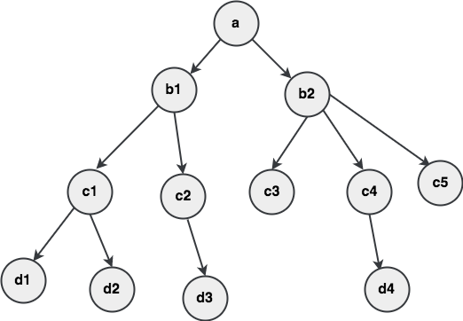
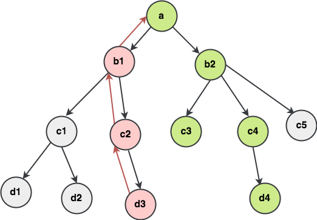
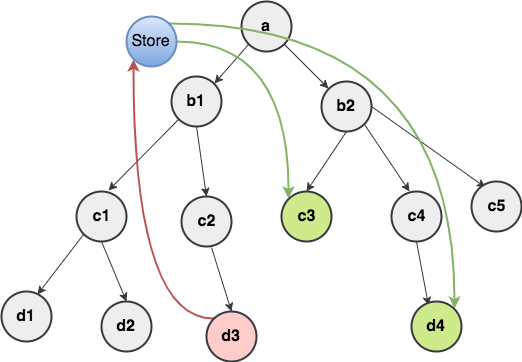
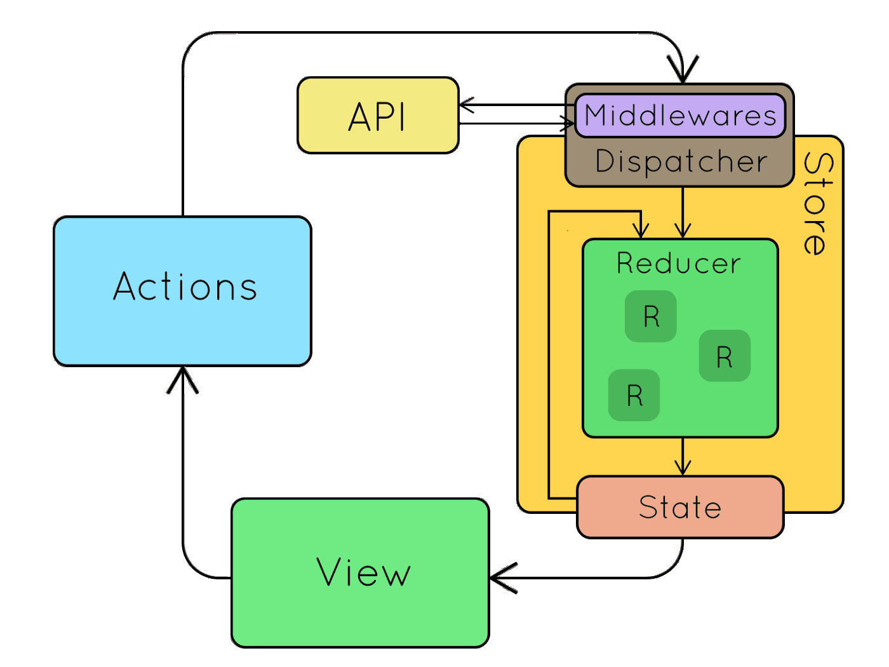

# Redux


Do yêu cầu cho các ứng dụng single-page sử dụng Javascript ngày càng trở lên phức tạp thì code của chúng ta phải quản lý nhiều state hơn. State có thể bao gồm là data trả về từ phía Server và được cached lại hay như dữ liệu được tạo ra và thao tác ở phía client mà chưa được đẩy lên phía server. UI state cũng trở lên phức tạp vì chúng ta cần quản lý việc active Routes, selected tabs, spinners, điều khiển phân trang …vv.

Việc quản lý từng thay đổi của **state** là rất khó: Vì nếu như khi ta thay đổi 1 **Model -&gt;** Model khác cũng thay đổi theo **và** nếu 1 **View** thay đổi -&gt; Model thay đổi -&gt; Model khác nữa cũng thay đổi theo. Về phía Front-end development, thì được kỳ vọng xử lý các vấn đề như “**optimistic updates**” \(_Hiểu như thể một thay đổi trên giao diện được thực hiện thành công trước khi được xác nhận từ phía server\)_, **render phía server**, **featching data** trước khi thực hiện chuyển trang …vv. Nếu như ko có một luồng xử lý khoa học và rõ ràng thì việc quản lý dữ liệu với các dự án lớn là vô cùng phức tạp.

Vấn đề phức tạp như đề cập ở trên sẽ còn càng khó xử lý hơn nữa vì chúng ta đang trộn lẫn 2 khái niệm mà nó ko tự nhiên với tư duy thông thường của con người đó là: **Biến đổi dữ liệu \(Mutation\)** và **tính bất đồng bộ \(Asynchronicity\)**, mặc dù chúng sẽ là tuyệt vời nếu dùng tách rời nhau, nhưng hoạt động cùng nhau sẽ gây ra sự hỗn độn.

React JS đã cố gắng giải quyết điều này ở trong tầng View bằng việc loại bỏ **Bất đồng bộ** và **Không thao tác trực tiếp trên DOM**, tuy nhiên việc quản lý state là tùy thuộc vào cách của bạn do vậy đây chính là lí do Redux xuất hiện để giúp bạn quản lý state một cách khoa học và hiệu quả hơn.

### Redux 

Redux ra đời lấy cảm hứng từ tư tưởng của ngôn ngữ **Elm** và kiến trúc **Flux** của Facebook . Do vậy Redux thường dùng kết hợp với React. Tuy nhiên hoàn toàn có thể sử dụng với các framework khác như **Angular, Angular2, Backbone, Falcor, Deku, Swift.**

Vậy bạn có cần biết Flux trước khi đến với Redux ko? câu trả lời là **KHÔNG** vì thật sự nếu bạn đã dùng flux thì cũng tốt, còn không thì bạn lại dễ tiếp cận hơn \(tránh lối mòn :D\).

### Quản lý state với Redux 

Giả sử chúng ta có 1 ứng dụng mà các node như trong hình là tượng trưng cho một single page application được mô hình tree-node.



Hình dung app của chúng ta vận hành bằng việc chuyển đổi qua lại data gữa các node, mỗi node \(trang con\) chứa một state và các node con nhận data được truyền từ node cha vào node con.

Giả sử nếu có 1 action ở **node d3** được kích hoạt và ta muốn thay đổi state **d4** và **c3** thì luồng dữ liệu sẽ được truyền từ **node d3** trở về node gốc là **a**, xong sau đó từ **node a** lại phát đi data đến các node con:

> Cập nhật state cho node d4: **d3-c2-b1-a-b2-c4-d4**
>
> Cập nhật state cho node c3: **d3-c2-b1-a-b2-c3**



Với những bài toán nhỏ \(chỉ cần dùng React JS ko cần Redux\) thì update state qua lại giữa các page có thể dễ dàng nhưng bạn thử hình dung ứng dụng lớn hơn có rất nhiều nhánh và node con thì việc thao tác update state qua lại giữa các page trở nên phức tạp hơn khiến cho flow của code cũng khó đọc và khó debug hơn.

Và giải pháp Redux đưa ra là như sau:



Quay lại bài toán ở trên thì ta chỉ cần map Action từ node d3 về store của redux rồi ở node c3 và d4 chỉ cần connect với store và cập nhật data thay đổi -&gt; hết sức đơn giản phải ko?

### Nguyên tắc hoạt động của Redux

Vừa xong phần lý thuyết để phần nào các bạn mường tượng ra triết lý của Redux tiếp theo sau đây mình sẽ đi sâu vào giải thích cụ thể hơn các thành phần của Redux

**a. Khái niệm cốt lõi:**

Hãy tưởng tượng state của app của bạn được mô tả như 1 object thuần dưới đây:

```javascript
{
  todos: [{
    text: 'Eat food',
    completed: true
  }, {
    text: 'Exercise',
    completed: false
  }],
  visibilityFilter: 'SHOW_COMPLETED'
}
```

Thật sự thì nó trông giống như 1 **model** ko có phương thức **setters** \( nghĩa là chỉ có thể lấy ra data mà ko cho phép thay đổi data đó\), điều này để tránh các thay đổi tùy tiện trong khi code gây ra việc khó debug.

Để thay đổi state, chỉ có 1 cách duy nhất là dispatch 1 action \(Mình sẽ nói ở phần sau\).

#### b. 3 nguyên tắc của Redux

> - **Single source of truth:** State của toàn bộ ứng dụng được lưu trong trong 1 store duy nhất là 1 Object mô hình tree.
>
> **- State is read-only:** Chỉ có 1 cách duy nhất để thay đổi state đó là tạo ra một action \(là 1 object mô tả những gì xảy ra\)
>
> - **Changes are made with pure functions:** Để chỉ rõ state tree được thay đổi bởi 1 action bạn phải viết pure **reducers**

**c. Nguyên tắc vận hành**



### Actions

Trong Redux action là 1 pure object định nghĩa 2 thuộc tính là : **type**: kiểu mô tả action, và **payload**: giá trị tham số truyền lên

```javascript
{
  type: "KIEU_ACTION",
  payload: //tham số
}
```

### Reducers

Action có nhiệm vụ mô tả những gì xảy ra nhưng lại không chỉ rõ phần state nào của response thay đổi -&gt; Việc này sẽ là của Reducer đảm nhiệm:

Reducer nhận 2 tham số vào: 1 state cũ và action được gửi lên sau đó trả ra một state mới, ko làm thay đổi state cũ.

```javascript
(previousState, action) => newState
```

### Store

Store là 1 object lưu trữ state của toàn bộ ứng dụng có 3 phương thức sau:

* **getState\(\)**: Giúp lấy ra state hiện tại
* **dispatch\(action\)**: Thực hiện gọi 1 action
* **subscrible\(listener\)**:Nó có vai trò cực quan trọng, luôn luôn lắng nghe xem có thay đổi gì ko rồi ngay lập tức cập nhật ra View

Để cho dễ hiểu hơn mình sẽ minh họa bằng ví dụ sau:

Ta có 1 reducer, khở tạo store thông qua hàm **createStore\(reducer\),** trong Redux.

```javascript
const counter = (state = 0, action) => {
    switch(action.type){
        case "INCREMENT":
            return state + 1;

        case "DECREMENT":
            return state - 1;

        default:
            return state;    
    }
}

const {createStore} = 'redux';
const store = createStore(counter);

store.subcrible(() => {
   document.body.innerText = store.getState(); //output in html page
});

//call to an action to increase number.
document.addEventListener('click', () => {
    store.dispatch({type:"INCREMENT"});
});
```

Phân tích vị dụ trên ta có:

* **Step 1**: Khởi tạo store cho project mà nó nhận tham số đầu vào là reducer **counter** ở trên:

```javascript
const store = createStore(counter);
```

* **Step 2**: Sau đó giả sử ta muốn tăng giá trị lên 1 thì call action với type là “INCREMENT” dùng hàm dispatch\(\) của store:

```javascript
document.addEventListener('click', () => {
   store.dispatch({type:"INCREMENT"});
});
```

* **Step 3**: lúc này là nhệm vụ của reducer, sẽ xem kiểu action gọi lên là gì “INCREMENT” hay “DECREMENT” để nó return ra 1 new state cụ thể ở đây là state + 1.
* **Step 4:** thằng ****subcrible\(\) trong store sẽ làm nhiệm vụ cập nhật tình hình thay đổi ra View:

```javascript
store.subcrible(() => {   
    document.body.innerText = store.getState(); 
});
```

Đến đây thì cơ bản bạn đã nắm được nguyên lý hoạt động cơ bản nhất của Redux mà tôi tạm rút gọn lại flow là:

> action -&gt; reducer -&gt; store -&gt; View

Ở phạm vi bài này mình đã trình bày nguyên lý cơ bản và cách thức hoạt động của Redux để các bạn có thể nắm được cũng như hình dung nó sinh ra để làm việc gì, bài viết mới thể hiện được các tình huống đơn giản nhất thông qua ví dụ đơn giản, còn trong khi làm dự án thực tế công việc chủ yếu là tương tác với server \(fetch data\) và xử lý data sau đó, thì đó là về bất đồng bộ **asynchronous** và xử lý **side-effect** sau mỗi action được gọi.

Việc này sẽ được Redux xử lý với **Redux-middleware**

